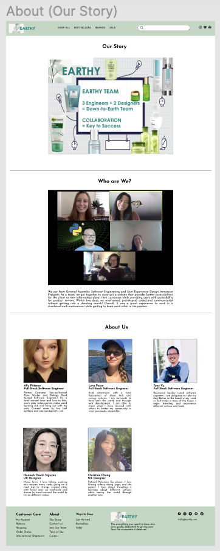
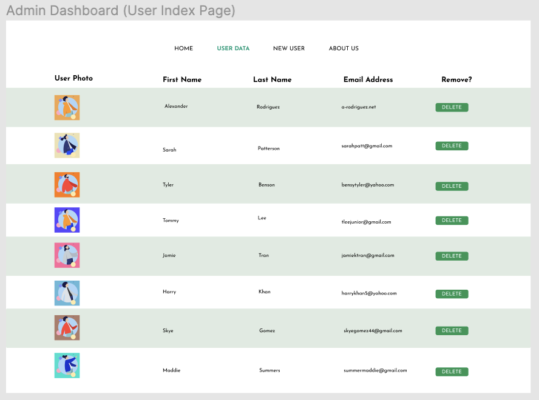
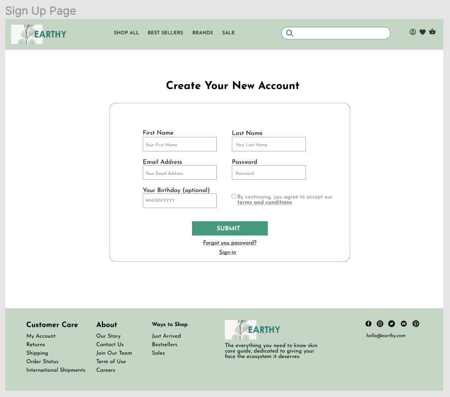
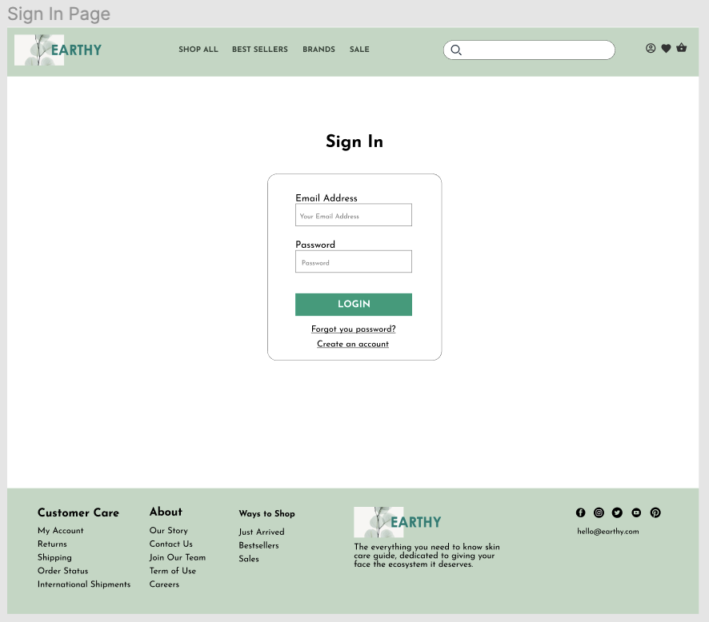
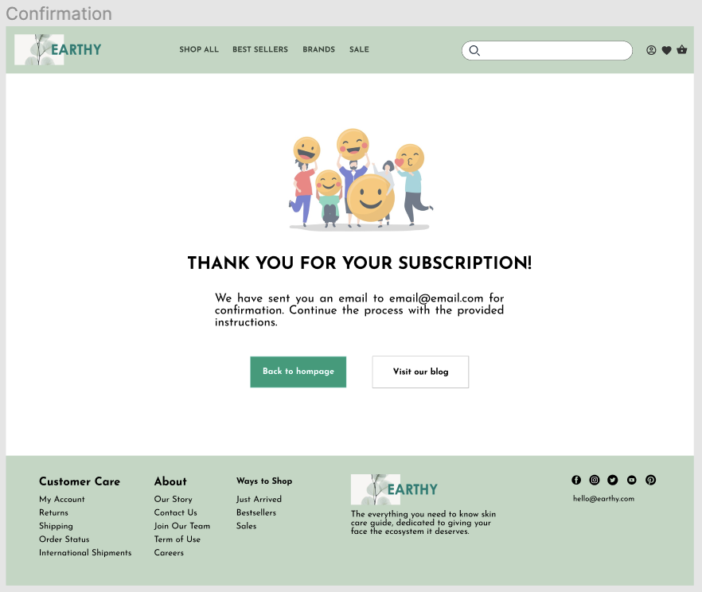
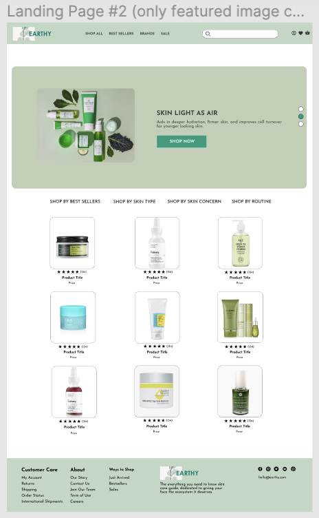
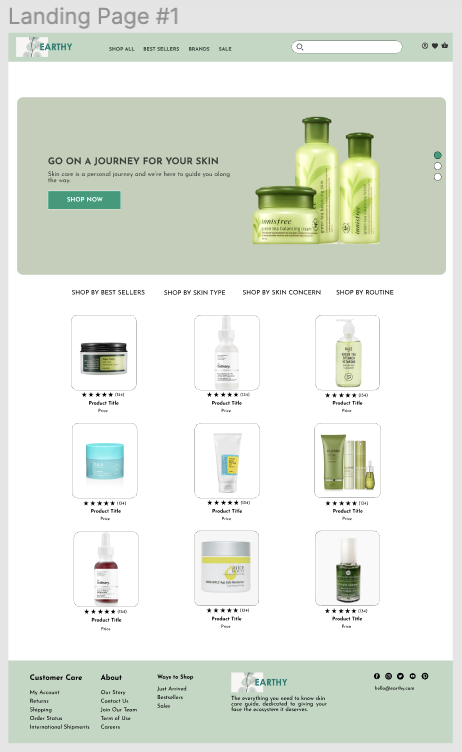
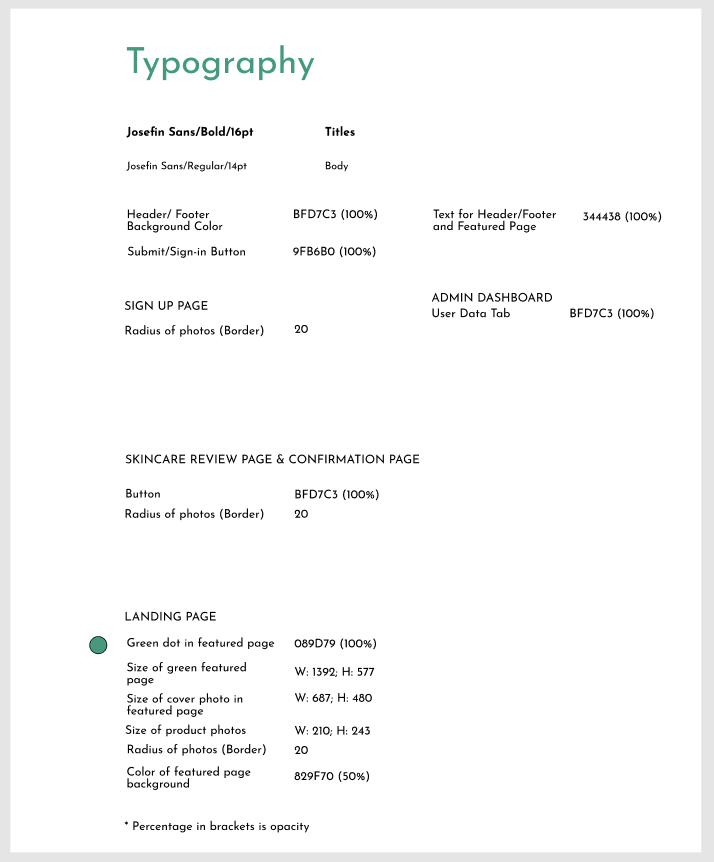

# Skin Care Product 24-hr Collaboration Project

This project was a collaboration work between two UX/UI designers and three Software Developers. We were given a prompt and a random business to make a landing page and user display page for. The requirements of the project were that it must include a way to add inputted user data to a database, the user data must be displayed on a separate page, the application must be accessible, and it must be formatted for mobile as well as desktop.

The prompt we were given was to create a web application for a skin care product review site.

## User Story

The home/landing page contains an image carousel showcasing catchy slogans and featured products. Beneath the carousel are links to let the user shop per a specification. A list of products, their rating and their price follows. Each product image is a clickable link to the show page.

The header includes icons to add a user, access liked items, and view shopping cart. The image with company name is a clickable link to the home page. There are links to "Shop All", "Best Sellers", "Brands", and "Sale" as well as a search bar.

The footer includes several links including clickable links to the "Our Story" page and the user display "Admin" page. A copyright notice is also included.

In the home page, if the user clicks on the "Best Sellers" and "Sale" links in the navigation bar or a product picture, they are brought to the show page. The show page displays a picture of the product with the name, price, star rating, and description underneath. Reviews from customers follow below with the reviewer's name, rating, and written review of the product. The final section includes a few featured products.

Clicking the "user" icon in the header will take the user to a "Sign Up" page where they will enter their first name, last name, and e-mail. Failing to enter anything into the text boxes will produce an alert to "Please fill out this field" upon clicking the "Add User" button. Once the user enters their information and clicks the "Add User" button, they are redirected to a confirmation page that tells the user an email has been sent to the email they inputted. Buttons below this message give the option to go back to the homepage or view the company's blog.

Clicking the "Admin" link in the footer will send the user to the user information display page. Pre-added users will appear with their user photo (default picture of a leaf for all newly added users), their name, email address, and a button option to delete the user. Clicking the "Delete" button next to a user will remove that user from the page and the database.

Clicking the "Our Story" link in the footer will take the user to the team's "About Us" page. This page includes a graphic about the team, a team picture, a team summary, and pictures/descriptions of each team mate.

## Wireframes

### About Us

### Admin Page/User Info

### Sign Up Page

### Sign In Page

### Sign Up Confirmation Page

### Product Show Page

### Landing Page

### Landing Page

### Typography Plan

## Technologies Used:

Figma

HTML5
CSS3
Node.js
Express
EJS
MongoDB
Mongoose
